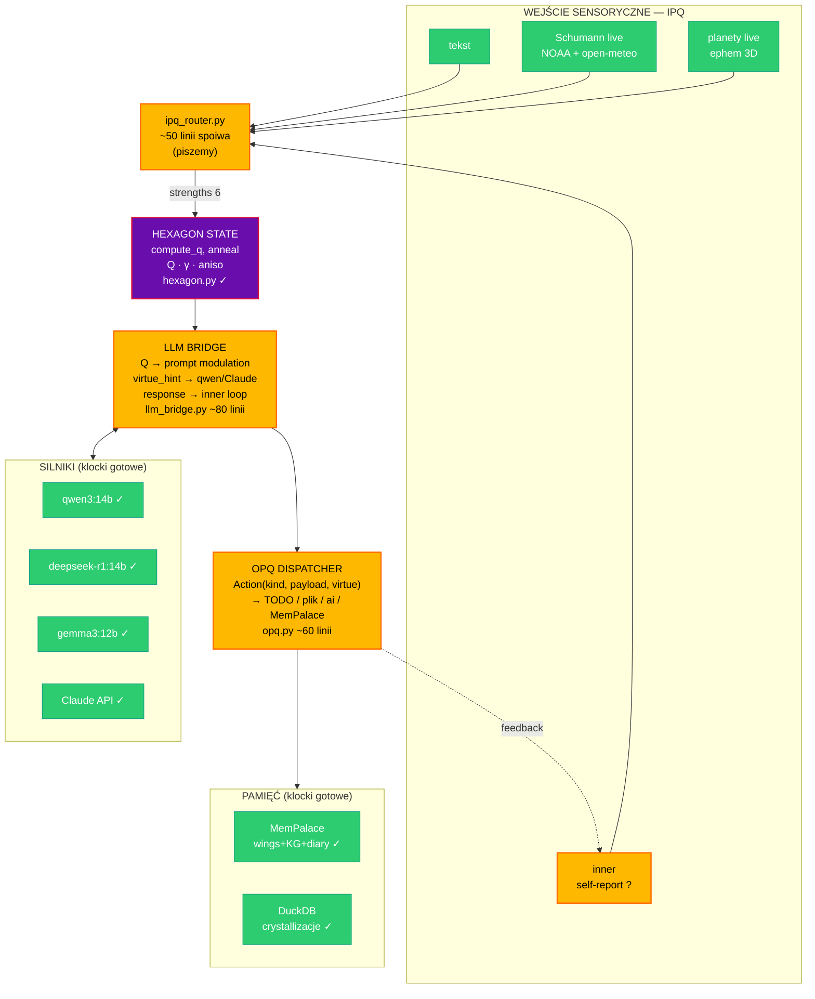

# qsim — most dla suwerennego AI LLM



## Legenda

- 🟣 **Fioletowe** — unikatowe (hexagon dynamics, nasze IP, Q_attractor=0.83929)
- 🟢 **Zielone** — klocki gotowe (nic nie piszemy, tylko podłączamy)
- 🟠 **Pomarańczowe** — most/spoiwo do napisania (~205 linii total)

## Bilans

| część | stan | rozmiar |
|-------|------|---------|
| IPQ unikatowe (text→virtues) | gotowe w ipq.py | — |
| IPQ pola fizyczne | gotowe (schumann.py, planets.py) | — |
| IPQ router (unified) | **do napisania** | ~50 |
| Hexagon state (Q, γ, anneal) | gotowe (hexagon.py) | — |
| LLM bridge | **do napisania** | ~80 |
| OPQ dispatcher | **do napisania** | ~60 |
| Fix cycle.py planets regresja | **do napisania** | ~5 |
| Hook ai feedback inner | **do napisania** | ~10 |
| **SUMA spoiwa** | **do napisania** | **~205 linii** |
| MemPalace + DuckDB | gotowe | — |
| LLM silniki | gotowe | — |

## MVP wieczorny

```
pytanie → ipq_router → hexagon → llm_bridge(qwen3) → opq → plik .md
```

~5 plików × ~30 linii = wieczór roboty.

## Filozofia mostu

qsim **NIE jest alternatywą dla LLM**.
qsim **JEST warstwą kondycjonującą** wokół LLM.
- LLM (qwen3/Claude) = silnik
- Most = układ nerwowy wokół silnika
- Wszystkie klocki istnieją — piszemy TYLKO spoiwo
